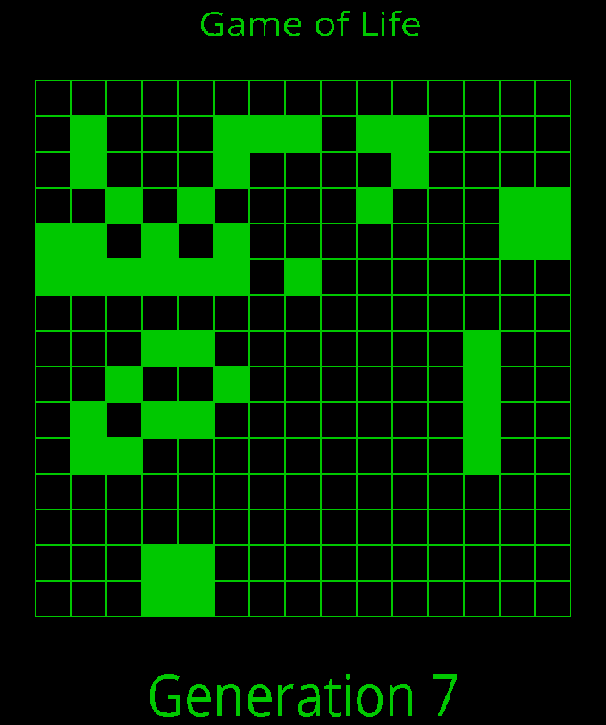

# Conway

Conway is a C implementation of [Conway's Game of Life](https://en.wikipedia.org/wiki/Conway%27s_Game_of_Life), a cellular automaton game that simulates the evolution of a grid of cells according to specific rules. The project is built using the SDL library and can be run in both an SDL app mode and a terminal app mode.

## SDL mode



## Terminal mode

```bash
1	1	1	1	1	0	1	1	1	1	1	1	1	1	0
0	1	0	0	0	0	0	0	1	1	0	1	0	0	1
1	1	0	0	0	1	1	1	0	0	0	1	1	1	0
1	0	1	0	0	1	0	1	1	1	0	1	1	1	1
0	0	0	0	0	0	1	1	0	1	1	0	1	0	0
1	0	0	1	0	0	0	0	1	0	1	0	1	0	1
1	0	1	1	0	1	0	1	1	0	1	0	0	0	1
0	1	1	0	0	1	1	1	1	0	1	0	0	0	1
1	1	1	0	1	0	0	1	1	1	1	0	1	1	0
0	0	0	1	0	0	0	1	1	1	0	0	0	0	1
1	0	0	0	0	1	0	0	0	0	1	1	0	1	1
1	1	1	1	1	1	1	1	1	1	1	1	1	1	1
0	0	1	1	0	0	0	1	0	1	1	0	0	1	1
1	0	0	0	1	1	0	1	1	1	0	0	0	1	1
1	0	1	1	1	1	1	1	0	1	0	1	1	1	1

Generation 0

1	1	1	1	0	0	0	1	0	0	0	1	1	1	0
0	0	0	1	1	0	0	0	0	0	0	0	0	0	1
1	0	1	0	0	1	0	0	0	0	0	0	0	0	0
1	0	0	0	0	1	0	0	0	1	0	0	0	0	1
0	1	0	0	0	0	1	0	0	0	0	0	0	0	1
0	1	1	1	1	0	0	0	0	0	1	0	0	0	0
1	0	0	1	0	1	0	0	0	0	1	0	0	0	1
0	0	0	0	0	1	0	0	0	0	1	0	0	0	1
1	0	0	0	1	1	0	0	0	0	1	1	0	1	1
1	0	1	1	1	0	1	1	0	0	0	0	0	0	1
1	0	0	0	0	1	0	0	0	0	0	0	0	0	0
1	0	0	0	0	1	0	1	0	0	0	0	0	0	0
1	0	0	0	0	0	0	0	0	0	0	0	0	0	0
0	0	0	0	0	0	0	0	0	0	0	1	0	0	0
0	1	0	1	0	0	0	1	0	1	1	0	1	0	1

Generation 1

0	1	1	1	1	0	0	0	0	0	0	0	1	1	0
1	0	0	0	1	0	0	0	0	0	0	0	1	1	0
0	1	0	1	0	1	0	0	0	0	0	0	0	0	0
1	0	0	0	0	1	1	0	0	0	0	0	0	0	0
1	1	0	1	1	1	0	0	0	0	0	0	0	0	0
1	1	0	1	1	1	0	0	0	0	0	0	0	0	0
0	1	0	1	0	1	0	0	0	1	1	1	0	0	0
0	0	0	0	0	1	1	0	0	1	1	0	0	0	1
0	1	0	0	0	0	0	0	0	0	1	1	0	1	1
1	0	0	1	0	0	1	0	0	0	0	0	0	1	1
1	0	0	1	0	1	0	1	0	0	0	0	0	0	0
1	1	0	0	0	0	1	0	0	0	0	0	0	0	0
0	0	0	0	0	0	0	0	0	0	0	0	0	0	0
0	0	0	0	0	0	0	0	0	0	1	1	0	0	0
0	0	0	0	0	0	0	0	0	0	1	1	0	0	0

Generation 2
```

## Ubuntu Prerequisites

Before you can build and run Conway, make sure you have the following installed on your system:

1.  [Make](https://www.gnu.org/software/make/)
2.  GCC (`apt install gcc`)
3.  SDL library (`apt-get install libsdl2-ttf-dev`)

## Build and Run Instructions

To build and run the project as an SDL app, execute:

```bash
$ make
# or
$ make sdl
```

For running in the terminal, use:

```bash
$ make terminal
```
