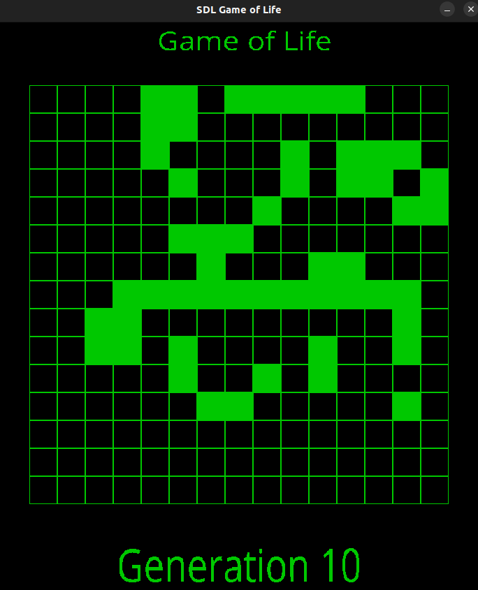

# SDL Game of Life

[Conway's Game of Life](https://en.wikipedia.org/wiki/Conway%27s_Game_of_Life) written in C. Built using SDL.

## SDL app mode



## Terminal app mode

```bash
1	1	1	1	1	0	1	1	1	1	1	1	1	1	0
0	1	0	0	0	0	0	0	1	1	0	1	0	0	1
1	1	0	0	0	1	1	1	0	0	0	1	1	1	0
1	0	1	0	0	1	0	1	1	1	0	1	1	1	1
0	0	0	0	0	0	1	1	0	1	1	0	1	0	0
1	0	0	1	0	0	0	0	1	0	1	0	1	0	1
1	0	1	1	0	1	0	1	1	0	1	0	0	0	1
0	1	1	0	0	1	1	1	1	0	1	0	0	0	1
1	1	1	0	1	0	0	1	1	1	1	0	1	1	0
0	0	0	1	0	0	0	1	1	1	0	0	0	0	1
1	0	0	0	0	1	0	0	0	0	1	1	0	1	1
1	1	1	1	1	1	1	1	1	1	1	1	1	1	1
0	0	1	1	0	0	0	1	0	1	1	0	0	1	1
1	0	0	0	1	1	0	1	1	1	0	0	0	1	1
1	0	1	1	1	1	1	1	0	1	0	1	1	1	1

Generation 0

1	1	1	1	0	0	0	1	0	0	0	1	1	1	0
0	0	0	1	1	0	0	0	0	0	0	0	0	0	1
1	0	1	0	0	1	0	0	0	0	0	0	0	0	0
1	0	0	0	0	1	0	0	0	1	0	0	0	0	1
0	1	0	0	0	0	1	0	0	0	0	0	0	0	1
0	1	1	1	1	0	0	0	0	0	1	0	0	0	0
1	0	0	1	0	1	0	0	0	0	1	0	0	0	1
0	0	0	0	0	1	0	0	0	0	1	0	0	0	1
1	0	0	0	1	1	0	0	0	0	1	1	0	1	1
1	0	1	1	1	0	1	1	0	0	0	0	0	0	1
1	0	0	0	0	1	0	0	0	0	0	0	0	0	0
1	0	0	0	0	1	0	1	0	0	0	0	0	0	0
1	0	0	0	0	0	0	0	0	0	0	0	0	0	0
0	0	0	0	0	0	0	0	0	0	0	1	0	0	0
0	1	0	1	0	0	0	1	0	1	1	0	1	0	1

Generation 1

0	1	1	1	1	0	0	0	0	0	0	0	1	1	0
1	0	0	0	1	0	0	0	0	0	0	0	1	1	0
0	1	0	1	0	1	0	0	0	0	0	0	0	0	0
1	0	0	0	0	1	1	0	0	0	0	0	0	0	0
1	1	0	1	1	1	0	0	0	0	0	0	0	0	0
1	1	0	1	1	1	0	0	0	0	0	0	0	0	0
0	1	0	1	0	1	0	0	0	1	1	1	0	0	0
0	0	0	0	0	1	1	0	0	1	1	0	0	0	1
0	1	0	0	0	0	0	0	0	0	1	1	0	1	1
1	0	0	1	0	0	1	0	0	0	0	0	0	1	1
1	0	0	1	0	1	0	1	0	0	0	0	0	0	0
1	1	0	0	0	0	1	0	0	0	0	0	0	0	0
0	0	0	0	0	0	0	0	0	0	0	0	0	0	0
0	0	0	0	0	0	0	0	0	0	1	1	0	0	0
0	0	0	0	0	0	0	0	0	0	1	1	0	0	0

Generation 2
```

## Ubuntu Prerequisites

```bash
$ apt-get install libsdl2-ttf-dev
```

### Troubleshoot

If you experience this error

```
make: gcc: No such file or directory
make: *** [<builtin>: src/main.o] Error 127
```

Install the following

```bash
$ apt install gcc
```

### How to build and run

```bash
# both ways will run in sdl app mode
$ sh build_and_run.sh
$ sh build_and_run.sh sdl

# terminal app mode
$ sh build_and_run.sh terminal
```
